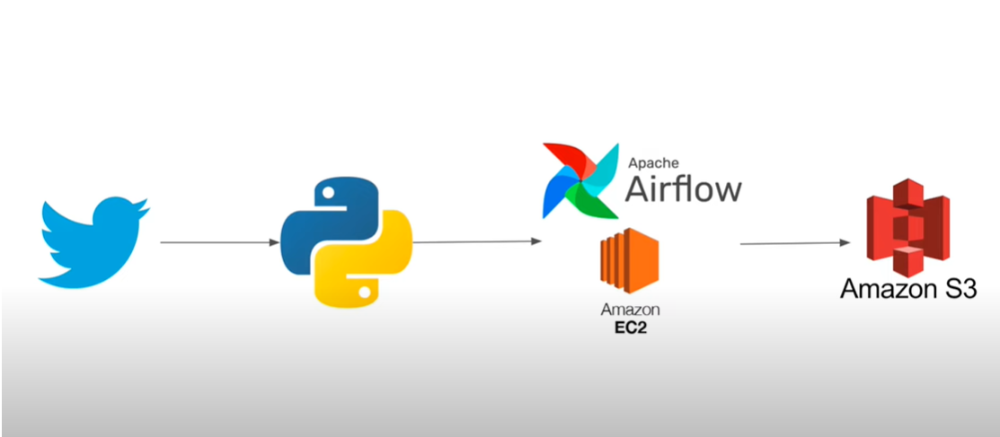

# Overview
This project is an ETL pipeline that ingests data from the Reddit API, selects a few useful columns, and exports the data to an S3 bucket. The pipeline is created using Apache Airflow, with Python, Pandas, Requests, and the AWS CLI used for running jobs and tasks. The project is deployed on an EC2 instance, which provides the runtime environment and web UI for data orchestration.

# Skill Demonstrated
This project demonstrates the following skills:
- Working with API requests, authentication tokens (OAuth2), and ETL jobs
- Deploying an Airflow codebase to an EC2 instance and using it for data orchestration
- Configuring the AWS CLI and S3 bucket for data storage and retrieval
- Working with Python libraries such as Pandas and Requests for data fetching, processing and manipulation

# Architecture Diagram



# Tool
The following tools were used in this project:
- Apache Airflow for creating and managing the data pipeline
- Python for implementing the ETL jobs and tasks
- Pandas and Requests for data fetching, processing and manipulation
- AWS CLI for configuring and accessing the S3 bucket
- EC2 instance for providing the runtime environment and web UI for data orchestration (airflow)

# Steps
To run this project, follow the steps below:
1. Update the EC2 instance by running the following commands:
```
sudo apt-get update
sudo apt install python3-pip
sudo apt install awscli
sudo pip install pandas s3fs apache-airflow python-dotenv requests
```

2. Start Airflow by running the following command:
```
airflow standalone
```

3. Create an S3 bucket to store the exported data.

4. Configure the Airflow DAG by copying the project code to the `~/airflow/reddit-dags` folder.

5. Change the IAM role permissions of the EC2 instance to give it write access to the S3 bucket.

6. Configure the AWS CLI so that EC2 can access correct S3 bucket:
```
aws configure set region ap-east-1
```

7. Update the datetime function to use Hong Kong time zone by adding the `pytz.timezone('Asia/Hong_Kong')` argument.

# Files
This project contains the following files:
- `reddit_etl.py`: Extracts data from the Reddit API, selects a few useful columns, and exports the data to an S3 bucket.
- `reddit_dag.py`: Creates a data pipeline (i.e., defines an Airflow DAG) with metadata, data validation, flow run monitoring, and failure handling.
