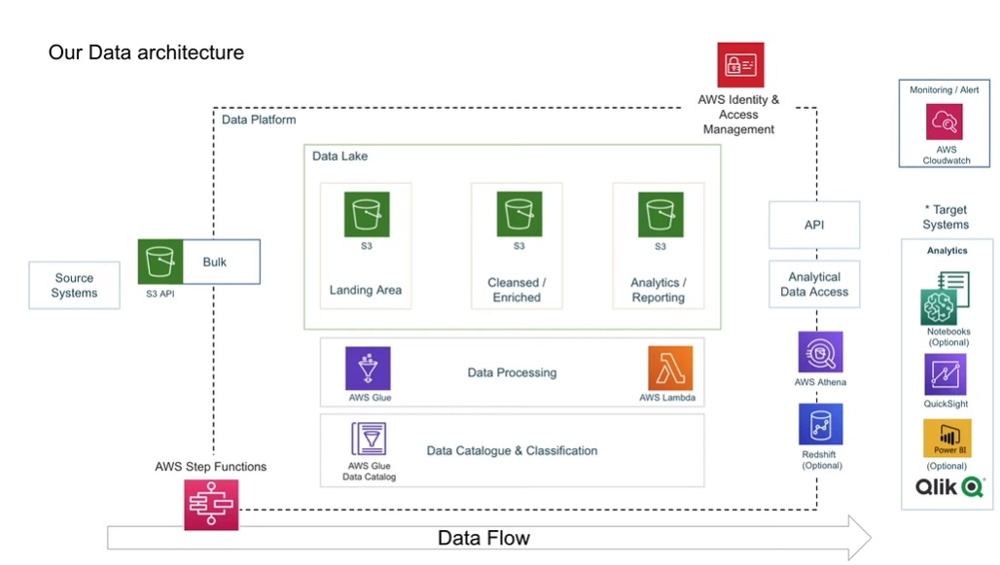

# Overview
This project is an ETL pipeline built on AWS to analyze YouTube video trending data. The data is sourced from [Kaggle's Trending YouTube Video Statistics dataset](https://www.kaggle.com/datasets/datasnaek/youtube-new), which contains information about trending videos from various regions and categories.

# Architecture Diagram

# Tools Used
- AWS Glue (ETL and Catalog)
- AWS S3 (Data Storage)
- AWS Lambda (Serverless Computing)
- AWS QuickSight (Business Intelligence)
- AWS Athena (Serverless Query Service)

# Steps Taken
1. Created an IAM user with limited permissions and downloaded the access key and credential information.
2. Installed AWS CLI, configured it and listed the S3 buckets.
3. Created an S3 bucket with a naming convention and uploaded the dataset to it.
4. Inferred the data schema and created a Glue database and IAM role.
5. Converted the JSON data to Apache Parquet using a Lambda function.
6. Created an AWS Crawler for CSV data and joined the category table and video table.
7. Added a job for data transformation and aggregation to create an analytics bucket.
8. Created an AWS QuickSight account to visualize the data.

# Skills Demonstrated
- Creating IAM users with limited permissions
- Installing and configuring AWS CLI
- Creating S3 buckets with naming conventions
- Uploading data to S3 using AWS CLI and Console
- Inference of data schema using AWS Glue
- Use of AWS Lambda function and trigger for data conversion
- Use Lambda Layer to provide install dependency for the computing environment
- Creation of AWS Crawler to automatically discover and catalog data
- Writing SQL queries in AWS Athena
- Data transformation and aggregation using AWS Glue Jobs
- Creating AWS QuickSight account and visualizing data in charts and graphs
- Cleaning up AWS resources

# Resource
- Link for lambda custom layer 
https://github.com/aws/aws-sdk-pandas/releases
